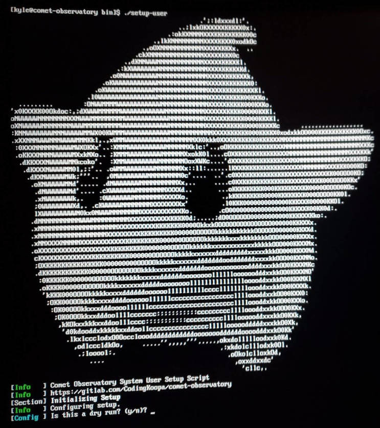

# Comet Observatory
**Comet Observatory** is a suite of scripts and configurations for use with [Linux](https://en.wikipedia.org/wiki/Linux). It is themed around the [Comet Observatory](https://www.mariowiki.com/Comet_Observatory) from the game [Super Mario Galaxy](https://en.wikipedia.org/wiki/Super_Mario_Galaxy), largely in titular fashion. In particularly, hardware components are named after locations within the Comet Observatory:
- The [Arch Linux](https://www.archlinux.org/) host, `comet-observatory`, is named after the Comet Observatory itself.
- The [Windows 10](https://www.microsoft.com/en-us/windows) host, `COMETOBSERVATORY`, is also named after the Comet Observatory itself.
- The [Debian](https://www.debian.org/) [Virtual Machine](https://en.wikipedia.org/wiki/Virtual_machine), `polari`, is named after [Polari](https://www.mariowiki.com/Polari).
- The [EFI System Partition](https://wiki.archlinux.org/index.php/EFI_system_partition), `Beacon`, is named after the [Beacon](https://www.mariowiki.com/Beacon).
- The [Microsoft Reserved Partition](https://en.wikipedia.org/wiki/Microsoft_Reserved_Partition), `Hungry Luma`, is named after the [Hungry Lumas](https://www.mariowiki.com/Hungry_Luma).
- The Arch and Windows [Operating System](https://en.wikipedia.org/wiki/Operating_system) partitions, respectively `Arch Engine Room` and `Windows Engine Room`, are named after the [Engine Room](https://www.mariowiki.com/Engine_Room).
- The shared document partition is named after the [Terrace](https://www.mariowiki.com/Terrace_(Super_Mario_Galaxy)).
- The storage partition is named after the [Library](https://www.mariowiki.com/Library_(Super_Mario_Galaxy)).
- The phone (connected via [KDE Connect](https://community.kde.org/KDEConnect)) is named after the [Gateway Galaxy](https://www.mariowiki.com/Gateway_Galaxy) (also see the [Gate](https://www.mariowiki.com/Gate_(Super_Mario_Galaxy))).

## Usage
Although functional on my own system, this repository isn't intended to be used in its entirety as-is. If using a script or configuration setup from this directory, the following should be taken into account:
- The entry points for everything are located in [`bin`](bin). As a result, all of the Bash scripts in [`bin`](bin) should be considered as libraries that export functionality that can be used by other scripts.
- The scripts are generally modular. For libraries sourced at the top of a script, they should be copied over, or their functionality re-implemented.
- The `COMET_OBSERVATORY` variable, expected to be pointed to this repository, should be changed or accounted for if necessary.
- All scripts are GPL 3.0 licensed.

## Features

### Setup Scripts (Installation Scripts)
The setup scripts ([system](bin/setup), [user](bin/setup-user)) are a couple of utilities that installs the packages and configurations that comprise my Arch installation. It can be ran after [installing the base system](https://wiki.archlinux.org/index.php/Installation_guide) and cloning this repository:



It can also be used to apply configuration changes to an existing configuration:


The scripts feature:
- Separation of user and root. The responsibilities of `setup-user` include installing configurations that only apply to, and should be owned by the user, configuring user [systemd](https://www.freedesktop.org/wiki/Software/systemd/) services, and building and installing the [AUR helper](https://wiki.archlinux.org/index.php/AUR_helpers) (an exception in which privledge escalation is used: installing the AUR helper package). The responsibilities of `setup` include installing system-wide configurations, configuring system systemd services, and installing packages using the AUR helper installed by `setup-user`.
- Simulation mode. By enabling dry run, the actions of the setup scripts can be printed, but will not actually take place.
- Configuration. Configuration prompts are used to slightly customize how the installation will be carried out, e.g. whether to enter simulation mode, whether to assume that private configuration files are present in `~/Documents`. These prompts can be skipped by providing default values as parameters. For example, the above screenshot is the result of running:
```sh
setup-user n y
```
- Log levels. Although these are supported throughout the Comet Observatory, they are particularly relevant here. Enabling more logging can be done by setting `DEBUG` or `VERBOSE` to true. These two options are two different levels; however, contrary to traditional logging systems, setting `DEBUG` does not automatically set `VERBOSE`, and vice versa.

### QEMU Reeves
[QEMU Reeves](bin/qemu-reeves) is a launcher for [QEMU](https://www.qemu.org/), tuned for Debian 10. It supports switching between images, video drivers and interfaces, and directly invokes QEMU. The only part of the `libvirt` stack used is the Remote Viewer, for when SPICE is used.


### UEFI Updater
The [UEFI updater](bin/update-efi) updates the [UEFI](https://uefi.org/) boot entries for a system using [EFISTUB](https://wiki.archlinux.org/index.php/EFISTUB) booting. It adds an entry for the vanilla kernel, and [Tk-Glitch's kernel](https://github.com/Tk-Glitch/PKGBUILDS). The [kernel parameters](https://wiki.archlinux.org/index.php/kernel_parameters) used depend on the preset used, defaulting to a [silent boot](https://wiki.archlinux.org/index.php/Silent_boot) configuration. Presets can be specified via a parameter to the script: `silent` (default), `debug`, `rescue-fallback`, and `rescue`. Finally, it sets the TkG kernel as the default.


### Windows Reboot
[`win-boot`](bin/win-boot) sets the UEFI next boot to the Windows Boot Manager.

### Music Downloader
These scripts are currently undergoing changes.

### Network Tablet Start Script
The [network tablet start](bin/start-network-tablet) script is used to start [GfxTablet](https://rfc2822.github.io/GfxTablet/) and map the tablet input.

### Shellcheck Wrapper
The [Shellcheck wrapper](bin/shellcheck-alt) is used to provide a [Shellcheck](https://github.com/koalaman/shellcheck) binary to helpers such as [shellcheck-vscode](https://marketplace.visualstudio.com/items?itemName=timonwong.shellcheck) while allowing external file checking.

## License
The scripts in this repository are licensed under the [GNU General Public License v3.0](https://www.gnu.org/licenses/gpl-3.0.en.html). Configuration files and other assets are unlicensed, unless specified otherwise.