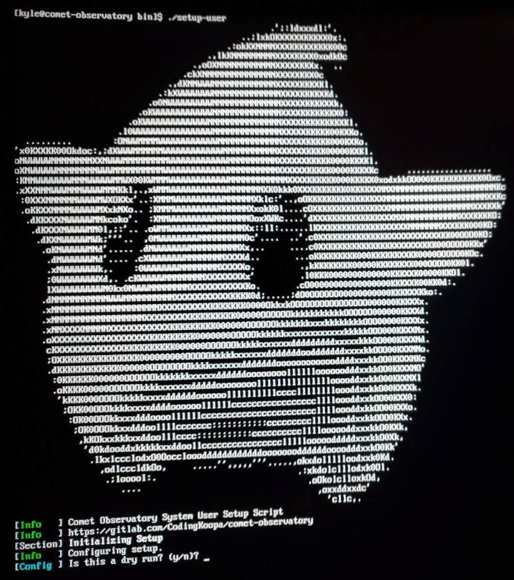
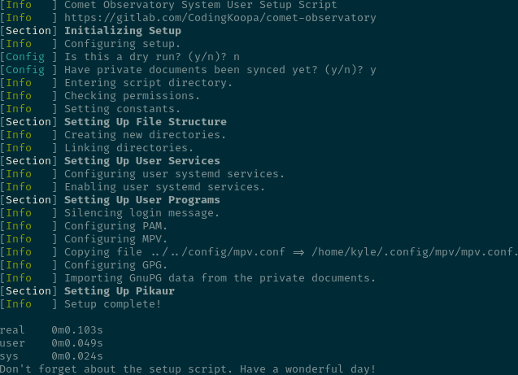
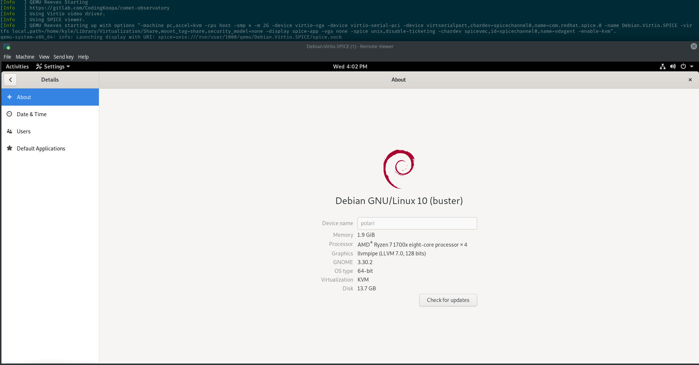
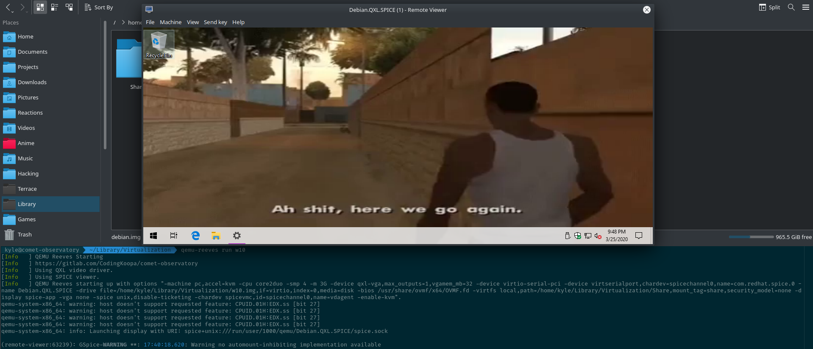

# Comet Observatory
**Comet Observatory** is a suite of scripts and configurations for use with [Linux](https://en.wikipedia.org/wiki/Linux). It is themed around the [Comet Observatory](https://www.mariowiki.com/Comet_Observatory) from the game [Super Mario Galaxy](https://en.wikipedia.org/wiki/Super_Mario_Galaxy), largely in titular fashion. In particularly, hardware components are named after locations within the Comet Observatory:
- The [Arch Linux](https://www.archlinux.org/) host, `comet-observatory`, is named after the Comet Observatory itself.
- The [Windows 10](https://www.microsoft.com/en-us/windows) host, `COMETOBSERVATORY`, is also named after the Comet Observatory itself.
- The [Debian](https://www.debian.org/) [Virtual Machine](https://en.wikipedia.org/wiki/Virtual_machine), `polari`, is named after [Polari](https://www.mariowiki.com/Polari).
- The Windows 10 VM, `gearmo`, is named after [Gearmo](https://www.mariowiki.com/Gearmo).
- The [EFI System Partition](https://wiki.archlinux.org/index.php/EFI_system_partition), `Beacon`, is named after the [Beacon](https://www.mariowiki.com/Beacon).
- The [Microsoft Reserved Partition](https://en.wikipedia.org/wiki/Microsoft_Reserved_Partition), `Hungry Luma`, is named after the [Hungry Lumas](https://www.mariowiki.com/Hungry_Luma).
- The Arch and Windows [Operating System](https://en.wikipedia.org/wiki/Operating_system) partitions, respectively `Arch Engine Room` and `Windows Engine Room`, are named after the [Engine Room](https://www.mariowiki.com/Engine_Room).
- The shared document partition is named after the [Terrace](https://www.mariowiki.com/Terrace_(Super_Mario_Galaxy)).
- The game partition is named after the [Fountain](https://www.mariowiki.com/Fountain).
- The storage partition is named after the [Library](https://www.mariowiki.com/Library_(Super_Mario_Galaxy)).
- The phone (connected via [KDE Connect](https://community.kde.org/KDEConnect)) is named after the [Gateway Galaxy](https://www.mariowiki.com/Gateway_Galaxy) (also see the [Gate](https://www.mariowiki.com/Gate_(Super_Mario_Galaxy))).

## Usage
Although functional on my own system, this repository isn't intended to be used in its entirety as-is. If using a script or configuration setup from this directory, the following should be taken into account:
- The entry points for everything are located in [`bin`](bin). As a result, all of the Bash scripts in [`scripts`](scripts) should be considered as libraries that export functionality that can be used by other scripts.
- The scripts are generally modular. For libraries sourced at the top of a script, they should be copied over, or their functionality re-implemented.
- The `COMET_OBSERVATORY` variable, expected to be pointed to this repository, should be changed or accounted for if necessary.
- All scripts are GPL 3.0 licensed.

## Documentation
Some subsystems of the Comet Observatory have their own write-ups:
- [Initialization](docs/Init.md), how environment variables are set once the user logs in, and in what order.
- [Authentication Setup](docs/Auth.md), how `gpg-agent` and `ssh-agent` are configured to be integrated with KWallet.

## Features

### Setup Scripts (Installation Scripts)
The setup scripts ([system](bin/setup-system), [user](bin/setup-user)) are a couple of utilities that installs the packages and configurations that comprise my Arch installation. It can be ran after [installing the base system](https://wiki.archlinux.org/index.php/Installation_guide) and cloning this repository:



It can also be used to apply configuration changes to an existing configuration:



The scripts feature:
- Separation of user and root. The responsibilities of `setup-user` include installing configurations that only apply to, and should be owned by the user, configuring user [systemd](https://www.freedesktop.org/wiki/Software/systemd/) services, and building and installing the [AUR helper](https://wiki.archlinux.org/index.php/AUR_helpers) (an exception in which privledge escalation is used: installing the AUR helper package). The responsibilities of `setup-system` include installing system-wide configurations, configuring system systemd services, and installing packages using the AUR helper installed by `setup-user`.
- Simulation mode. By enabling dry run, the actions of the setup scripts can be printed, but will not actually take place.
- Configuration. Configuration prompts are used to slightly customize how the installation will be carried out, e.g. whether to enter simulation mode, whether to assume that private configuration files are present in `~/Documents`. These prompts can be skipped by providing default values as parameters. For example, the above screenshot is the result of running:
```sh
setup-user n y
```
- Log levels. Although these are supported throughout the Comet Observatory, they are particularly relevant here. Enabling more logging can be done by setting `DEBUG` or `VERBOSE` to true. These two options are two different levels; however, contrary to traditional logging systems, setting `DEBUG` does not automatically set `VERBOSE`, and vice versa.

### QEMU Reeves
[QEMU Reeves](bin/qemu-reeves) is a launcher for [QEMU](https://www.qemu.org/), tuned for Debian 10 and Windows 10. It supports switching between images, video drivers and interfaces, and directly invokes QEMU. It also has modes for creating disk images, and running installers. The only part of the `libvirt` stack used is the Remote Viewer, for when SPICE is used.




### UEFI Updater
The [UEFI updater](bin/update-efi) updates the [UEFI](https://uefi.org/) boot entries for a system using [EFISTUB](https://wiki.archlinux.org/index.php/EFISTUB) booting. It adds an entry for the vanilla kernel, and [Tk-Glitch's kernel](https://github.com/Tk-Glitch/PKGBUILDS). The [kernel parameters](https://wiki.archlinux.org/index.php/kernel_parameters) used depend on the preset used, defaulting to a [silent boot](https://wiki.archlinux.org/index.php/Silent_boot) configuration. Presets can be specified via a parameter to the script: `silent` (default), `debug`, `rescue-fallback`, and `rescue`. Finally, it sets the TkG kernel as the default.


### Windows Reboot
[`win-boot`](bin/win-boot) sets the UEFI next boot to the Windows Boot Manager.

### Music Downloader
These scripts are currently undergoing changes.

### Network Tablet Start Script
The [network tablet start](bin/start-network-tablet) script is used to start [GfxTablet](https://rfc2822.github.io/GfxTablet/) and map the tablet input.

### Shellcheck Wrapper
The [Shellcheck wrapper](bin/shellcheck-alt) is used to provide a [Shellcheck](https://github.com/koalaman/shellcheck) binary to helpers such as [shellcheck-vscode](https://marketplace.visualstudio.com/items?itemName=timonwong.shellcheck) while allowing external file checking.

## License
The scripts in this repository are licensed under the [GNU General Public License v3.0](https://www.gnu.org/licenses/gpl-3.0.en.html). Configuration files and other assets are unlicensed, unless specified otherwise.