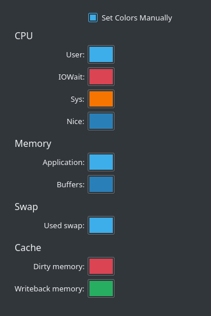

# System Load
This document goes over how I monitor my system status. I used to use the CPU load monitor widget from KDE Plasma, but that [seems to have stopped working for me](https://bugs.kde.org/show_bug.cgi?id=415500). Now, I use the system load widget. Here's what it looks like as I type this:

From left to right, this widget indicates CPU, memory, swap, and cache status. It's a little bit weird; for example, I know that my memory is not actually that "free", and that the dark shade of blue representing buffers should be bigger, according to `free` and `top`, which tell me that 1.4GB of my memory are being used for buffers and cache. Aside from that little quirk which could be my own misunderstanding, I quite like this widget. I have it configured like so:

The default custom colors are in pretty poor taste, so I polished all of these up using the Breeze Dark colors, [according to KDE's HIG](https://hig.kde.org/style/color/dark.html). My rationale for these is as follows:
- User CPU usage, application memory usage, and swap usage is all normal. Use regular Plasma Blue.
- Nice CPU usage and buffers are of no concern, but are different from the norm. Use Abyss Blue.
- System CPU usage shouldn't be too high. Tread with caution; use Beware Orange.
- IOWait and dirty memory we really shouldn't have that much of. Use Icon Red.
- Writeback memory is good; this means dirty memory is being handled. Use Noble Fir.
